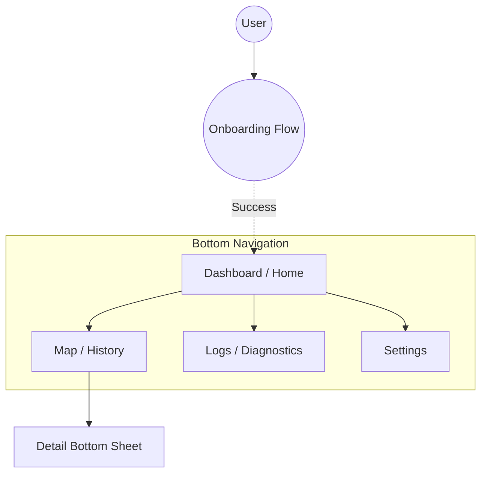

# Navigation Architecture

**Parent:** [UI & Presentation Specification](../ui_presentation_spec.md)

The application uses a flat hierarchy with a **Bottom Navigation Bar** for top-level destinations.

## 1. Navigation Graph (Mermaid)

## 2. Top-Level Destinations
1.  **Dashboard:** Current status, immediate stats, manual actions.
2.  **Map:** Historical data visualization and exploration.
3.  **Logs:** Real-time diagnostic log stream and filters.
4.  **Settings:** Configuration, identity, and app-wide preferences.

## 3. Navigation & Back Handling
*   **Map:** Pressing the Back Button while the "Bottom Sheet" is expanded/open must collapse/close the sheet first. If the sheet is already minimized, the Back Button acts normally (backgrounds app).
*   **Dashboard:** As the start destination, pressing the Back Button must background the application (standard Android Home behavior).
